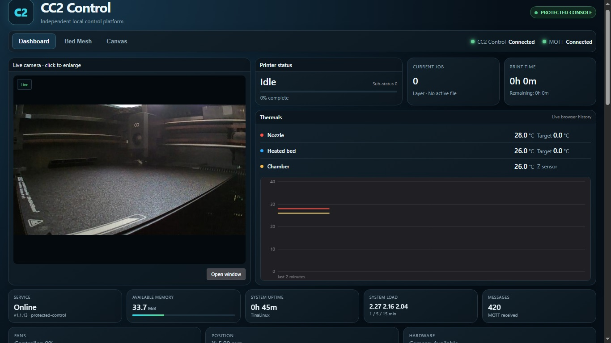

# Centauri Carbon 2 Community

Independent community project maintained by **Neme77** for the ELEGOO Centauri Carbon 2.

> This project is not affiliated with, endorsed by, or supported by ELEGOO.
> ## Community Firmware v3.9

Firmware v3.9 integrates **CC2 Control 1.1.14**, a lightweight on-printer web
dashboard available at `http://PRINTER-IP:8081`.

Highlights include live telemetry and camera, protected printer controls,
persistent custom material presets, a protected Klipper console, 11×11 Bed Mesh
2D/3D visualisation and native four-slot ELEGOO Canvas support. Clean installs
are configured from the browser; existing credentials and presets survive A/B
firmware updates under `/opt/usr`.

> **Important:** after completing the first-run browser configuration on a clean
> installation, perform one complete printer reboot. This allows Canvas to
> synchronize correctly with both CC2 Control and the original printer interface.

See [CC2 Control documentation](docs/CC2_CONTROL.md), the
[v3.9 installation guide](docs/INSTALL_V3_9.md) and the
[v3.9 release](https://github.com/Neme77/centauri-carbon-2-community/releases/tag/V3.9).

## Downloads

|                                                                                                                                **FIRMWARE v3.8**                                                                                                                                |                                                                                                              **ELEGOO-WEB v4.4.0**                                                                                                             |
| :-----------------------------------------------------------------------------------------------------------------------------------------------------------------------------------------------------------------------------------------------------------------------------: | :--------------------------------------------------------------------------------------------------------------------------------------------------------------------------------------------------------------------------------------------: |
|                                        |  |
|                                                         **[Download firmware (.zip.sig)](https://github.com/Neme77/centauri-carbon-2-community/releases/download/v3.8/CC2_V3_8_STOCK_20260915_052727_a28a8a16.zip.sig)**                                                        |                                          **[Download portable app (.zip)](https://github.com/Neme77/centauri-carbon-2-community/releases/download/elegoo-web-v4.4.0/ELEGOO-Web-v4.4.0-Portable.zip)**                                          |
|                                                                                                              Centauri Carbon 2 only · Base 02.01.00.00 · 123.9 MiB                                                                                                              |                                                                                                Windows 10/11 x64 · .NET Framework 4.8 · 5.1 MiB                                                                                                |
| [Release notes](https://github.com/Neme77/centauri-carbon-2-community/releases/tag/v3.8) · [Installation](docs/INSTALL.md) · [SHA-256](https://github.com/Neme77/centauri-carbon-2-community/releases/download/v3.8/CC2_V3_8_STOCK_20260915_052727_a28a8a16.zip.sig.sha256.txt) |               [Release notes](https://github.com/Neme77/centauri-carbon-2-community/releases/tag/elegoo-web-v4.4.0) · [Setup](elegoo-web/README.md) · SHA-256: `704ea08d745ecb16d193852382037a01f6f813b32a3e9422030d2b8fa8097d2f`              |

**Firmware:** copy the downloaded `.zip.sig` unchanged to USB storage; do not extract it.
**App:** extract the entire ZIP and run `ElegooWeb.exe`; no compilation required.

[Browse all releases](https://github.com/Neme77/centauri-carbon-2-community/releases)

## Firmware v3.8

Firmware v3.8 is based on the verified ELEGOO **02.01.00.00** firmware and keeps the v3.7 feature set while completing local access in WAN/cloud mode.

### Firmware features

* Root SSH access; consult the firmware installation documentation for access details.
* Extended GUI Z-offset range.
* Dual Trust v2: official ELEGOO packages remain accepted while community-signed updates can also be installed.
* Local HTTP access on port 80 in both LAN-only and WAN/cloud modes.
* File upload while a print is already running when the client permits it.
* Live OrcaSlicer temperature updates in WAN/cloud mode without manual refresh.
* Local webcam access in WAN/cloud mode while the Matrix service remains operational.
* Tested WAN → LAN → WAN mode switching.

The existing four-client video limit is unchanged in v3.8.

Read the dedicated [firmware v3.8 documentation](docs/FIRMWARE_V3_8.md), [installation guide](docs/INSTALL.md), [build guide](docs/BUILD.md), and [test record](docs/TESTING.md).

## ELEGOO-Web v4.4.0

ELEGOO-Web is a small portable Windows controller for the printer's local web interface. It starts a local server on the PC, stores the printer connection parameters, opens the UI, and provides a QR code for phones or tablets on the same LAN.

**Version 4.4.0 provides a complete Italian and English desktop interface.** Language switching is immediate and covers controls, status messages, printer discovery, errors, QR messages and configuration guidance. The selected language is also used by the printer Web UI and retained in `config.json`.

Automatic discovery introduced in v4.3.0 remains available. After entering the printer IP address and Access Code, the application retrieves:

* serial number;
* machine model;
* hostname.

Manual serial-number entry remains available as a fallback. The application uses the printer's authenticated local `/system/info` service and does not require root, SSH, Python, WSL, administrator privileges, or a cloud connection.

The portable package includes the compiled C# application; no compilation is required for normal use. Existing v4.2.0 and v4.3.0 configuration files remain compatible. Do not share `config.json`, because it contains the printer Access Code in plain text.

Read the separate [ELEGOO-Web README](elegoo-web/README.md).

## Repository contents

* `cc2_builder_v3_8/` — v3.8 builder, patches, public keys, tools, and tests.
* `launch_helpers_v3_8/` — Windows/WSL build launcher.
* `elegoo-web/` — ELEGOO-Web documentation and versioned C# source code, including v4.4.0.
* `docs/` — installation, build, firmware, and validation documentation.
* `releases/` — release notes and publication records.

The v3.7 source remains in the repository as historical material.

## Files intentionally excluded

The Git source tree does not contain:

* ELEGOO stock firmware or modified vendor executables;
* private signing keys or the firmware AES key;
* printer credentials or personal configuration files;
* the tested `elegoo_printer` binary reference;
* third-party web UI and server binaries used by the portable application.

Release assets are distributed separately from the source tree. Users rebuilding from source must supply legally obtained external components. See [BUILD.md](docs/BUILD.md).

## License and warranty

Original project contributions are licensed under **GPL-3.0-only**. Existing third-party notices and terms continue to apply to their respective material. See `LICENSE` and `NOTICE.md`.

Modified firmware can damage or disable a printer. Use it only on the supported model and firmware base, keep the official recovery package available, and proceed at your own risk. No warranty is provided.

