# ELEGOO Centauri Carbon 2 Community Firmware

Open-source community firmware, tools and documentation for the **ELEGOO Centauri Carbon 2 (CC2)**, maintained by **Neme77**. The project extends the stock platform while preserving the original ELEGOO ecosystem wherever possible.

> This project is not affiliated with, endorsed by, or supported by ELEGOO.

## Community Firmware V4.1

> [!NOTE]
> **R8 clean-install fix:** CC2 Control now waits for the persistent `/opt/usr` partition before creating its configuration directory. First-run LAN-code saving works correctly without the previous SSH workaround.

Firmware **V4.1** is the largest CC2 Control integration update so far. It integrates **CC2 Control 1.1.25** directly into the firmware and makes the same interface available both from a normal browser and from the **OrcaSlicer Device tab** at:

```text
http://PRINTER-IP:8081
```

> [!IMPORTANT]
> **Reboot the printer once after the firmware installation has completed.**  
> This post-install reboot is required to fully initialize CC2 Control, Canvas state, the Panda/Moonraker-like service, and the printer-side background services before normal use.

### V4.1 highlights

- **CC2 Control 1.1.25** integrated into the firmware
- Dashboard and controls available in a browser and inside **OrcaSlicer Device**
- Live camera, temperatures, fans, printer state, current job, memory, uptime and service health
- G-code file manager for internal storage and USB, with thumbnails and print launch
- ELEGOO Canvas four-slot management and material presets
- Canvas spool-selection popup before multicolour prints, including from OrcaSlicer
- 2D/3D Bed Mesh visualization and isolated four-screw load-cell tramming
- Object Exclusion for labelled multi-object prints
- Protected expert console with homing, motion and printing-state guards
- Panda / Moonraker-like compatibility service on TCP **7125**
- Stable discovery/capability API v1 for future integrations
- Original `elegoo_printer` kept unchanged


Two complete V4.1 installation cycles were performed successfully on hardware before publication.


### CC2 Control


#### Dashboard


<p align="center">
  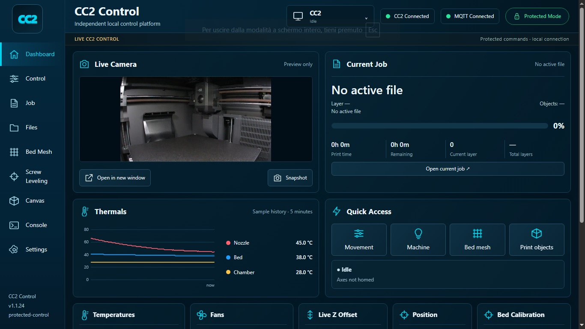
</p>


#### Main controls


| Printer Control | Current Job |
|---|---|
|  | 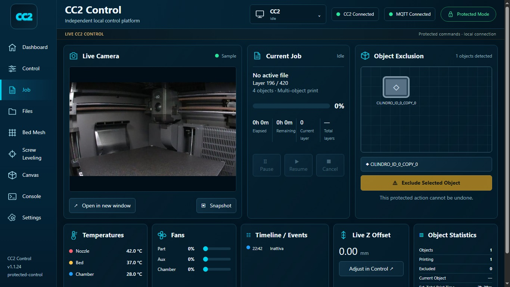 |


#### Files and print library


| File Manager | File Details / Preview |
|---|---|
| 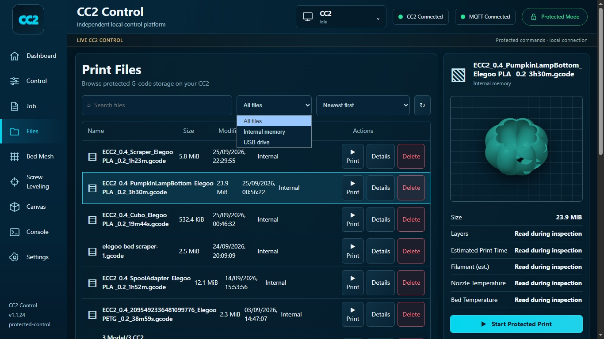 | 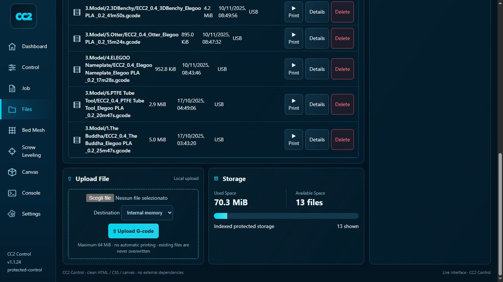 |


#### Canvas and protected console


| Canvas | Protected Console |
|---|---|
| 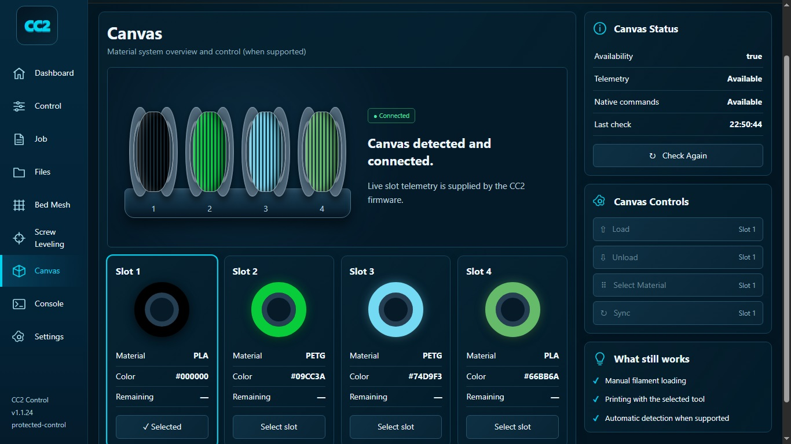 | 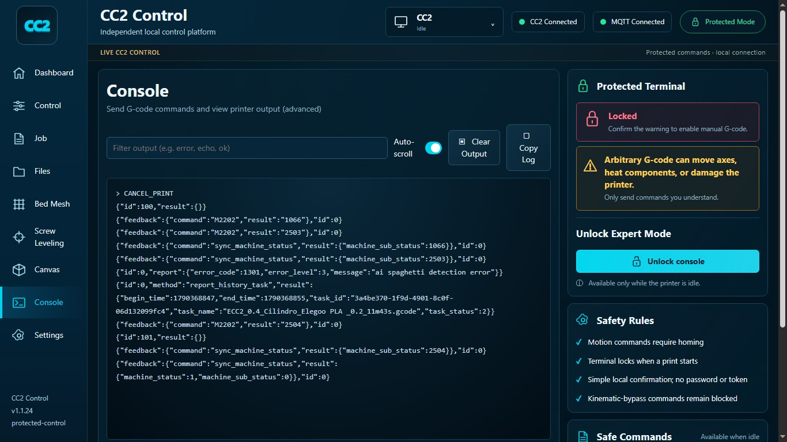 |


#### Bed Mesh


| Bed Mesh | Bed Mesh Detail |
|---|---|
| 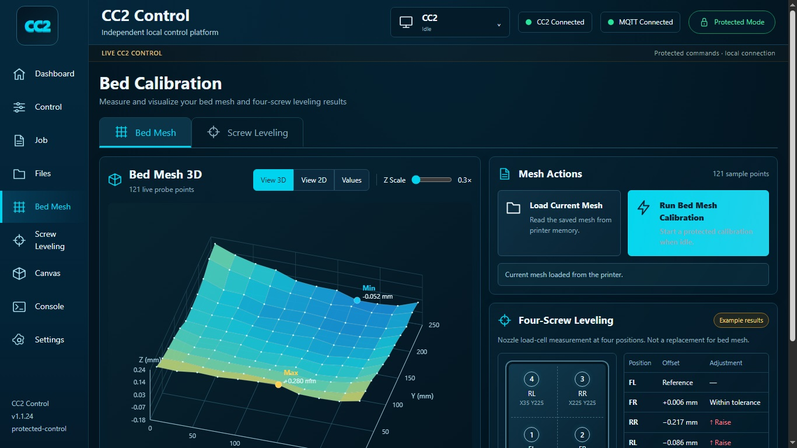 | 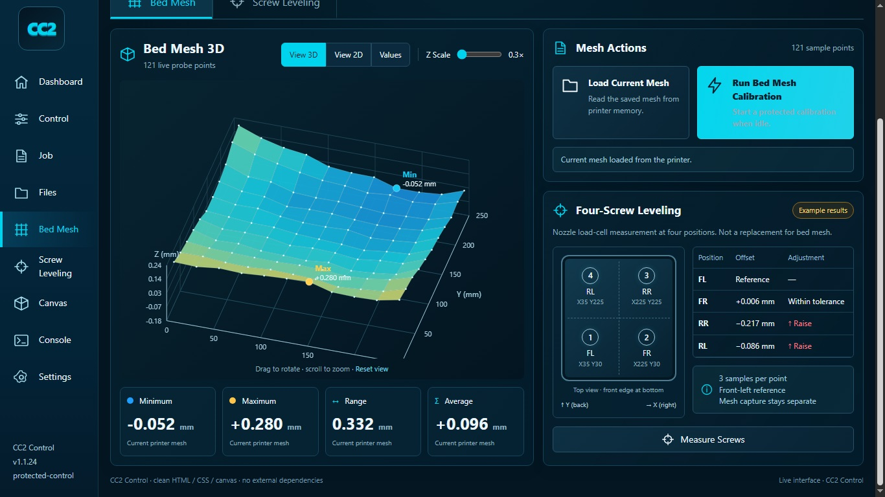 |


#### OrcaSlicer Device integration


| CC2 Control in OrcaSlicer | Canvas workflow in OrcaSlicer |
|---|---|
| 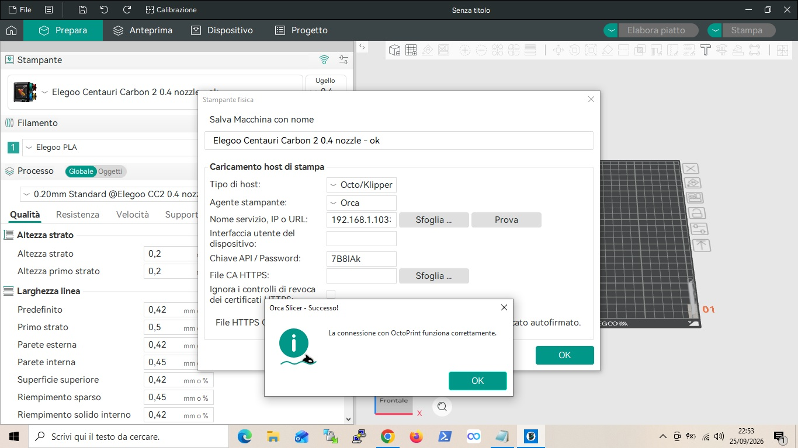 | 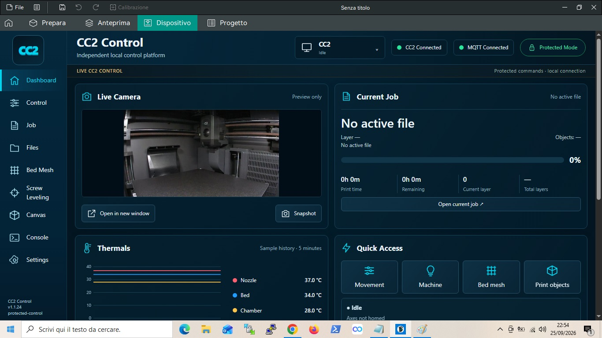 |


#### Settings


<p align="center">
  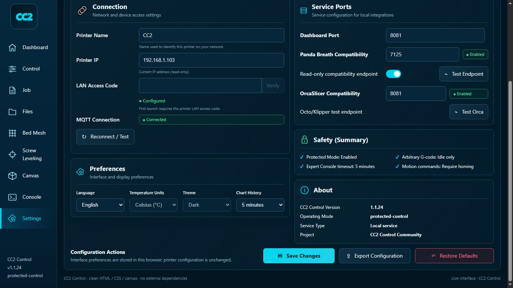
</p>


For the full V4.1 feature list see [Firmware V4.1](docs/FIRMWARE_V4_1.md).  
For installation and the required post-install reboot see [Installing V4.1](docs/INSTALL_V4_1.md).  
For CC2 Control internals and safety behaviour see [CC2 Control](docs/CC2_CONTROL.md).


For the project's technical background, architecture discoveries and implementation record, see [CC2 Research & Technical Findings](docs/CC2_RESEARCH.md).


## Downloads


### Community Firmware V4.1


| Firmware V4.1 | Builder V4.1 | CC2 Control source |
| :---: | :---: | :---: |
| [](https://github.com/Neme77/centauri-carbon-2-community/releases/download/V4.1/CC2_V4_1_STOCK_20260926_125358_67008870.zip.sig) | [](https://github.com/Neme77/centauri-carbon-2-community/releases/download/V4.1/CC2_BUILDER_V4_1_CC2_CONTROL_1.1.25_R8_PERSISTENT_MOUNT_FIX.zip) | [](https://github.com/Neme77/centauri-carbon-2-community/releases/download/V4.1/CC2-Control-v4.1.zip) |
| **[Firmware (.zip.sig)](https://github.com/Neme77/centauri-carbon-2-community/releases/download/V4.1/CC2_V4_1_STOCK_20260926_125358_67008870.zip.sig)** | **[Builder (.zip)](https://github.com/Neme77/centauri-carbon-2-community/releases/download/V4.1/CC2_BUILDER_V4_1_CC2_CONTROL_1.1.25_R8_PERSISTENT_MOUNT_FIX.zip)** | **[CC2 Control source (.zip)](https://github.com/Neme77/centauri-carbon-2-community/releases/download/V4.1/CC2-Control-v4.1.zip)** |
| Centauri Carbon 2 only · Base 02.01.00.00 · CC2 Control 1.1.25 | Builder R8 · persistent-mount fix | CC2 Control 1.1.25 source + web UI + tests |
| [Release notes](https://github.com/Neme77/centauri-carbon-2-community/releases/tag/V4.1) · [Installation](docs/INSTALL_V4_1.md) · [SHA-256](https://github.com/Neme77/centauri-carbon-2-community/releases/download/V4.1/CC2_V4_1_STOCK_20260926_125358_67008870.zip.sig.sha256.txt) | [Checksums](SHA256SUMS_V4_1.txt) | SHA-256: `5ac04aa43f350ad7798566bfe8be64aae37f06fd0b73747bf65ee10666750b89` |
