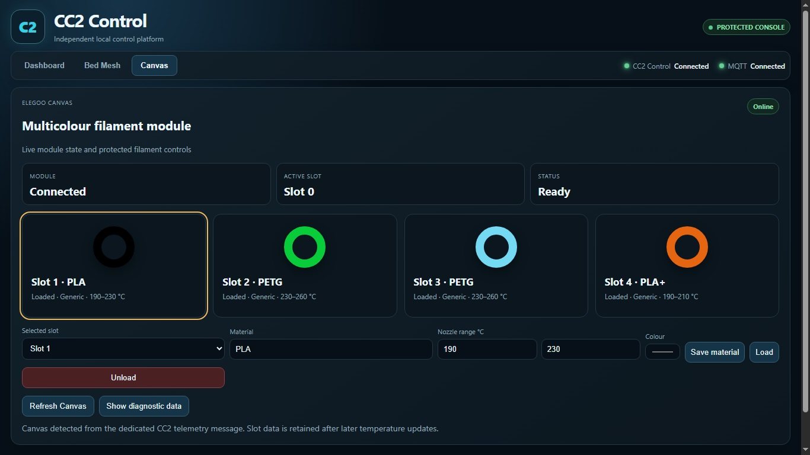

# ELEGOO Centauri Carbon 2 Community Firmware

Open-source community firmware, tools and documentation for the **ELEGOO Centauri Carbon 2 (CC2)**, maintained by **Neme77**. The project extends the stock platform while preserving the original ELEGOO ecosystem wherever possible.

> This project is not affiliated with, endorsed by, or supported by ELEGOO.

## Community Firmware V4.1

Firmware **V4.1** is the largest CC2 Control integration update so far. It integrates **CC2 Control 1.1.25** directly into the firmware and makes the same interface available both from a normal browser and from the **OrcaSlicer Device tab** at:

```text
http://PRINTER-IP:8081
```

> [!IMPORTANT]
> **Reboot the printer once after the firmware installation has completed.**  
> This post-install reboot is required to fully initialize CC2 Control, Canvas state, the Panda/Moonraker-like service, and the printer-side background services before normal use.

### V4.1 highlights

- **CC2 Control 1.1.25** integrated into the firmware
- Dashboard and controls available in a browser and inside **OrcaSlicer Device**
- Live camera, temperatures, fans, printer state, current job, memory, uptime and service health
- G-code file manager for internal storage and USB, with thumbnails and print launch
- ELEGOO Canvas four-slot management and material presets
- Canvas spool-selection popup before multicolour prints, including from OrcaSlicer
- 2D/3D Bed Mesh visualization and isolated four-screw load-cell tramming
- Object Exclusion for labelled multi-object prints
- Protected expert console with homing, motion and printing-state guards
- Panda / Moonraker-like compatibility service on TCP **7125**
- Stable discovery/capability API v1 for future integrations
- Original `elegoo_printer` kept unchanged

Two complete V4.1 installation cycles were performed successfully on hardware before publication.

### CC2 Control

| Dashboard | Printer controls |
|---|---|
|  |  |

| Canvas | Protected console |
|---|---|
|  |  |

> New V4.1 screenshots, including the OrcaSlicer Device integration and Canvas workflow, are being added to the documentation gallery.

For the full V4.1 feature list see [Firmware V4.1](docs/FIRMWARE_V4_1.md).  
For installation and the required post-install reboot see [Installing V4.1](docs/INSTALL_V4_1.md).  
For CC2 Control internals and safety behaviour see [CC2 Control](docs/CC2_CONTROL.md).

For the project's technical background, architecture discoveries and implementation record, see [CC2 Research & Technical Findings](docs/CC2_RESEARCH.md).

## Downloads

### Community Firmware V4.1

Firmware file:

```text
CC2_V4_1_STOCK_20260926_015216_446f1846.zip.sig
```

SHA-256:

```text
868814647d3835c193f0f0625e9037545a5a5128ee504ce74c62fbc4c4f41e19
```

Copy the firmware `.zip.sig` unchanged to USB storage; **do not extract or rename it**.

Builder package:

```text
CC2_BUILDER_V4_1_CC2_CONTROL_1.1.25_R7_RELEASE_FIXED.zip
```

The firmware and builder are intended for the **Centauri Carbon 2 only** and are based on official ELEGOO firmware **02.01.00.00**.

Previous firmware: [V4.0 release](https://github.com/Neme77/centauri-carbon-2-community/releases/tag/V4.0).

### ELEGOO-WEB

[](https://github.com/Neme77/centauri-carbon-2-community/releases/download/elegoo-web-v4.4.0/ELEGOO-Web-v4.4.0-Portable.zip)

Windows 10/11 x64 · .NET Framework 4.8 · [Setup](elegoo-web/README.md)

### Restore official ELEGOO firmware

If you need to return the Centauri Carbon 2 to the original stock firmware, the verified base firmware used during Community Firmware development and recovery testing is **ELEGOO 02.01.00.00**.

[](https://iot-p.elegoo.com.cn/devs/share/ota/fdm/209e2ccf-1bc7-48f2-8238-f4d0e18b98b3_1783510643046_cc2_eeb001_02.01.00.00_20260707170825.zip.sig)

**[Download official ELEGOO firmware 02.01.00.00 directly from the ELEGOO OTA server](https://iot-p.elegoo.com.cn/devs/share/ota/fdm/209e2ccf-1bc7-48f2-8238-f4d0e18b98b3_1783510643046_cc2_eeb001_02.01.00.00_20260707170825.zip.sig)**

This link points directly to ELEGOO's OTA server. The package is not hosted, modified, or maintained by this project. Community Firmware development has been validated through repeated stock → community → stock → community installation and recovery cycles using firmware 02.01.00.00.

> **Note:** 02.01.00.00 is the verified stock recovery/base version for this project; it is not presented as ELEGOO's latest available firmware.

## Acknowledgements

Hardware validation and testing contribution: **Barry Green**.
