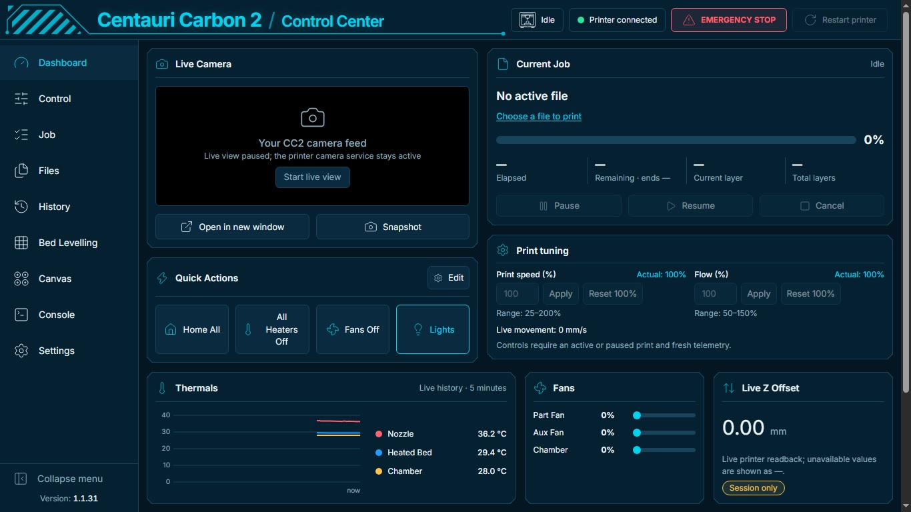
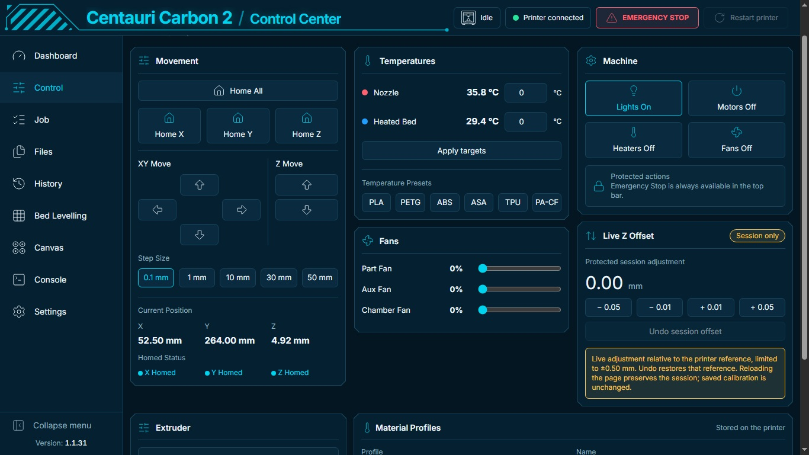
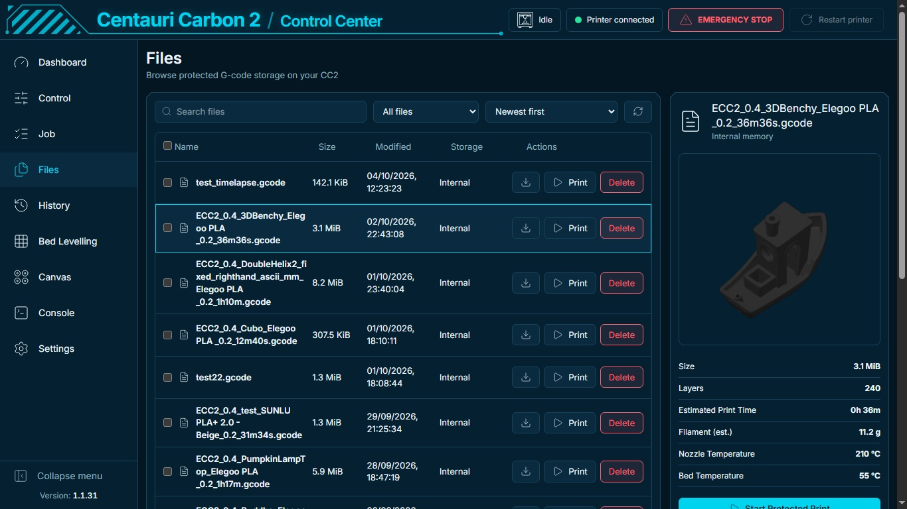
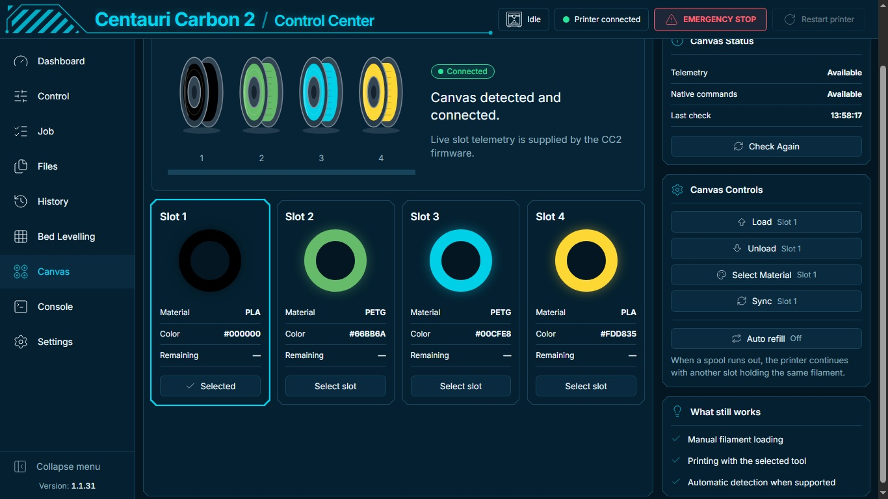
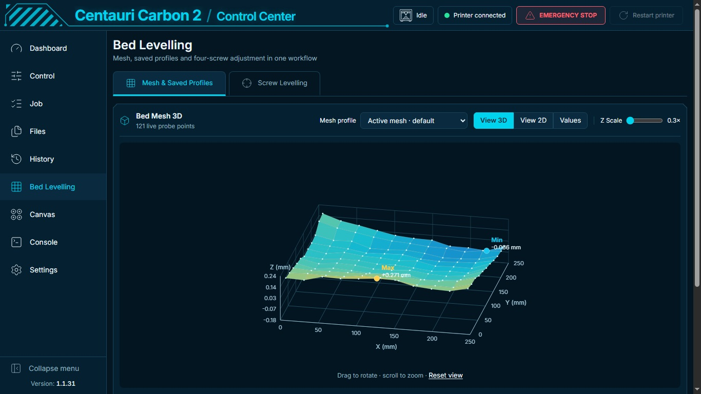
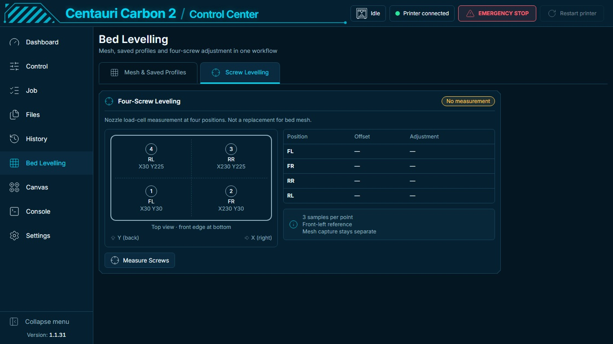

# Centauri Carbon 2 Community Firmware

Community firmware, local printer control and reproducible build tools for the **ELEGOO Centauri Carbon 2**, maintained by **Neme77**.

> Independent community project. Not affiliated with, endorsed by or supported
> by ELEGOO.

## Current release

| Component          |                                                                                         Version |
| ------------------ | ----------------------------------------------------------------------------------------------: |
| Community firmware |                 [V4.2-R5](https://github.com/Neme77/centauri-carbon-2-community/releases/tag/V4.2-R5) |
| CC2 Control        | [1.1.31](https://github.com/Neme77/centauri-carbon-2-community/releases/tag/V4.2-R5) |

Release binaries, standalone updaters, source archives and checksums are kept with the corresponding GitHub Release. The canonical development source is kept directly on `develop`.

## Downloads

<p align="center">
  <a href="https://github.com/Neme77/centauri-carbon-2-community/releases/download/V4.2-R5/CC2_V4_2_STOCK_20261004_135126_9cead4b7.zip.sig"></a>
  <a href="https://github.com/Neme77/centauri-carbon-2-community/releases/download/V4.2-R5/CC2-Control-1.1.31-R5-Multiplatform-Update.zip"></a>
  <a href="https://github.com/Neme77/centauri-carbon-2-community/releases/download/V4.2-R5/CC2-Control-1.1.31-R5-Source.zip"></a>
</p>

<p align="center">
  <a href="https://github.com/Neme77/centauri-carbon-2-community/releases/download/V4.2-R5/CC2-Builder-V4.2-R5-CC2-Control-1.1.31.zip"></a>
  <a href="https://github.com/Neme77/centauri-carbon-2-community/releases/download/V4.2-R5/SHA256SUMS_V4_2_R5_RELEASE.txt"></a>
</p>

<p align="center">
  <a href="https://github.com/Neme77/centauri-carbon-2-community/releases/tag/V4.2-R5"><strong>Release notes, checksums and all V4.2-R5 downloads</strong></a>
</p>

| Choose this file                                                                                                                                                                                                      | When to use it                                                                                          |
| --------------------------------------------------------------------------------------------------------------------------------------------------------------------------------------------------------------------- | ------------------------------------------------------------------------------------------------------- |
| [`CC2_V4_2_STOCK_20261004_135126_9cead4b7.zip.sig`](https://github.com/Neme77/centauri-carbon-2-community/releases/download/V4.2-R5/CC2_V4_2_STOCK_20261004_135126_9cead4b7.zip.sig)                                     | New installation or complete Community Firmware V4.2-R5 update                                             |
| [`CC2-Control-1.1.31-R5-Multiplatform-Update.zip`](https://github.com/Neme77/centauri-carbon-2-community/releases/download/V4.2-R5/CC2-Control-1.1.31-R5-Multiplatform-Update.zip)                               | Existing Community Firmware installation: update only CC2 Control, without reflashing the full firmware |
| [`CC2-Control-1.1.31-R5-Source.zip`](https://github.com/Neme77/centauri-carbon-2-community/releases/download/V4.2-R5/CC2-Control-1.1.31-R5-Source.zip) | CC2 Control source; updater packaging tools are in `cc2-control/installer/`                                            |
| [`CC2-Builder-V4.2-R5-CC2-Control-1.1.31.zip`](https://github.com/Neme77/centauri-carbon-2-community/releases/download/V4.2-R5/CC2-Builder-V4.2-R5-CC2-Control-1.1.31.zip)                               | Firmware builder R5                                                                                     |
| [`SHA256SUMS_V4_2_R5_RELEASE.txt`](https://github.com/Neme77/centauri-carbon-2-community/releases/download/V4.2-R5/SHA256SUMS_V4_2_R5_RELEASE.txt)                                                                                             | Verify downloaded release files                                                                         |

## Already running an older Community Firmware?

If your printer already runs an earlier Community Firmware release, you do not need to reflash the complete firmware just to update CC2 Control.

Use the standalone updater:

[`CC2-Control-1.1.31-R5-Multiplatform-Update.zip`](https://github.com/Neme77/centauri-carbon-2-community/releases/download/V4.2-R5/CC2-Control-1.1.31-R5-Multiplatform-Update.zip)

The standalone updater replaces only CC2 Control and preserves the persistent LAN access code, material presets and interface preferences. CC2 Control 1.1.31 also adds LAN-code revalidation and OrcaSlicer Moonraker-agent Canvas filament synchronization. After the update, CC2 Control realigns its local services automatically, so an additional printer reboot or full power cycle should not be necessary.

For detailed instructions, see [Installation](docs/INSTALL.md).

## Changed the printer LAN access code?

If you change the LAN access code from the printer, update the same code in CC2 Control at `http://PRINTER-IP:8081` under **Settings → Connection**.

Enter the new code, select **Verify**, then **Save changes**.

If CC2 Control does not immediately reconnect after the LAN code change, restart only the CC2 Control service over SSH:

```sh
/etc/init.d/cc2-control restart
```

This restarts CC2 Control without rebooting or power-cycling the printer.

If the old code prevents access to the configuration page entirely, reset only the CC2 Control connection configuration:

```sh
/etc/init.d/cc2-control stop
rm -f /opt/usr/cc2-control/cc2-control.conf
/etc/init.d/cc2-control start
```

Then reload `http://PRINTER-IP:8081` and complete the initial setup with the new LAN access code. Material presets and interface preferences are preserved.

## Features

| Area | What you can do |
| --- | --- |
| Dashboard and print tuning | Monitor temperatures, fans, print progress and live movement; adjust **print speed (25–200%)** and **extrusion flow (50–150%)** during an active or paused print with fresh telemetry. |
| File manager | Browse internal and USB storage, search and sort files, inspect model thumbnails and print metadata, upload G-code, **download G-code to your computer**, delete files and start a protected print. |
| Canvas and print continuity | View four material slots, colours and presets; select, load or unload a spool; enable **Auto refill** so the printer can continue from another slot holding the same filament when one spool runs out. |
| Print popup and timelapse | Choose filament-slot mapping and bed side before printing, use a saved mesh or a calibrated start, and **enable timelapse recording for that print**. |
| History | Review jobs recorded by the printer, including start time, duration and result; download ready timelapse videos and render recorded frames into a video while Idle. Delete individual records or clear loaded completed records with confirmation; G-code files are preserved. |
| Camera | Start live viewing on request, take snapshots and open the viewer in a separate window. CC2 coordinates camera ownership between its pages and windows and releases the viewer when it closes; the vendor camera service remains active. |
| Printer control | Home and move axes, set nozzle and bed targets, use material temperature presets, control fans and lights, extrude filament and adjust the live session Z offset. |
| Bed levelling | View the mesh in 2D or interactive 3D, inspect values and saved profiles, choose Side A / Side B, use adaptive probing and measure four-screw adjustment with the nozzle load cell. |
| Quick Actions and safety | Configure dashboard shortcuts with real light-state feedback; use object exclusion, a protected console and global emergency stop. Heater-off actions require fresh Idle telemetry. |
| Printer status and connection | See native machine sub-states and refusal messages; obtain telemetry through persistent UDS sessions, discover the printer serial automatically using saved LAN credentials, and revalidate a changed LAN code. |
| Slicer and integrations | Upload from OrcaSlicer and use the Panda/Moonraker compatibility endpoint on port `7125`, including Canvas filament synchronization. The local control dashboard runs on port `8081`. |
| Interface | Use English, Italian, French, Chinese or Russian; choose Light, Dark, Dracula, Nord, Monokai or Solarized Light themes; save appearance preferences and collapse the navigation menu. |

## Community contributions

First and foremost, a special thank you to **[@Surfoo](https://github.com/Surfoo)** for the outstanding work on the complete UI rewrite, the care put into its design and usability, and the continuing interface improvements. His contribution has transformed the CC2 Control experience.

A huge thank you to **DamiBFryta**, our dedicated beta tester, for ideas, testing and debugging throughout the project.

Thank you to **[@beanbo](https://github.com/beanbo)** for printer sub-states, refusal reporting, Canvas auto-refill and print history ([#67](https://github.com/Neme77/centauri-carbon-2-community/pull/67)), and camera ownership across CC2 pages ([#71](https://github.com/Neme77/centauri-carbon-2-community/pull/71)).

Thank you to **[@Skcycos](https://github.com/Skcycos)** for the Simplified Chinese translation ([#26](https://github.com/Neme77/centauri-carbon-2-community/pull/26)), **[@beanbo](https://github.com/beanbo)** for the Russian translation ([#63](https://github.com/Neme77/centauri-carbon-2-community/pull/63)), and **[@Surfoo](https://github.com/Surfoo)** for the French translation and JSON localization system ([#15](https://github.com/Neme77/centauri-carbon-2-community/pull/15)). Their work makes CC2 Control accessible to more users.

## Source layout

| Path                                   | Contents                                                    |
| -------------------------------------- | ----------------------------------------------------------- |
| [`cc2-control/`](cc2-control/)         | C backend, web UI, scripts, tests and protocol notes        |
| [`builder/current/`](builder/current/) | Current firmware build logic and host-side tests            |
| [`docs/`](docs/)                       | Installation, architecture, build and testing documentation |
| [`CHANGELOG.md`](CHANGELOG.md)         | User-visible project history                                |
| [`AGENTS.md`](AGENTS.md)               | Repository working rules for contributors and coding agents |

Historical versions are preserved through Git tags, GitHub Releases and Git history instead of parallel version-specific documents on `main`.

## Documentation

- [Installation](docs/INSTALL.md)
- [Build and reproduction](docs/BUILD.md)
- [Architecture](docs/ARCHITECTURE.md)
- [CC2 Control](docs/CC2_CONTROL.md)
- [Source and third-party inputs](docs/SOURCE.md)
- [Testing](docs/TESTING.md)
- [Contributing](CONTRIBUTING.md)

## Interface preview

### Dashboard

Live telemetry, on-demand camera viewing and configurable Quick Actions.

<p align="center">
  
</p>

### Printer control and files

<table>
  <tr>
    <td align="center"><strong>Printer control</strong></td>
    <td align="center"><strong>G-code files</strong></td>
  </tr>
  <tr>
    <td></td>
    <td></td>
  </tr>
</table>

### Canvas

Material slots, spool selection and automatic refill controls.

<p align="center">
  
</p>

### Bed levelling

<table>
  <tr>
    <td align="center"><strong>3D bed mesh</strong></td>
    <td align="center"><strong>Four-screw levelling</strong></td>
  </tr>
  <tr>
    <td></td>
    <td></td>
  </tr>
</table>

## AI-assisted development

This project uses AI-assisted development tools as part of the workflow, including support for code review, refactoring, debugging, documentation and selected code generation tasks.

A substantial part of the codebase is written and maintained directly by the project maintainer. Architecture decisions, reverse engineering, hardware testing, printer-side validation and release approval are performed by the maintainer and community testers.

AI-assisted changes are reviewed and validated before being included in a release.

## License and notices

Project code is provided under GPL-3.0-only where the contributors have the right to license it. Vendor firmware and third-party components keep their own terms. See [`LICENSE`](LICENSE) and [`NOTICE.md`](NOTICE.md).

