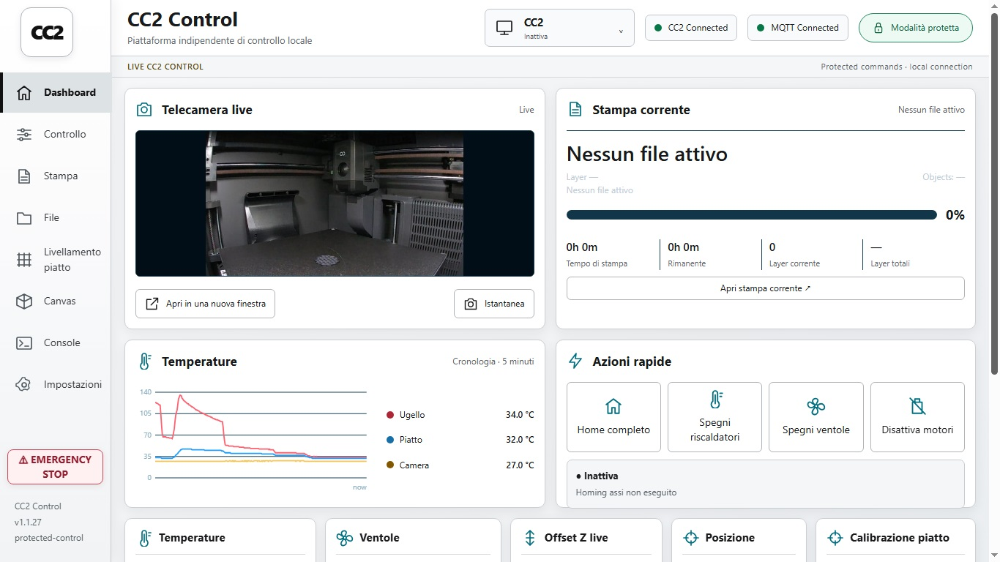
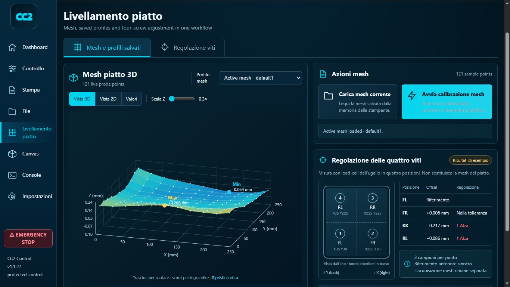
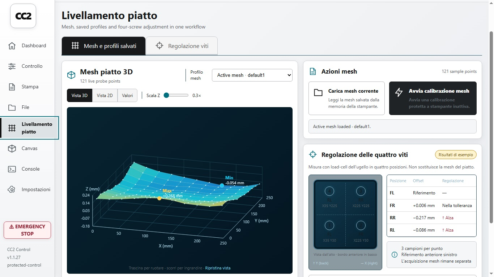

# Centauri Carbon 2 Community Firmware

Community firmware, local printer control and reproducible build tools for the
**ELEGOO Centauri Carbon 2**, maintained by **Neme77**.

> Independent community project. Not affiliated with, endorsed by or supported
> by ELEGOO.

## Current release

| Component | Version |
|---|---:|
| Community firmware | [V4.2](https://github.com/Neme77/centauri-carbon-2-community/releases/tag/V4.2) |
| CC2 Control | 1.1.30 |

Release binaries, standalone updaters, source archives and checksums are kept
with the corresponding GitHub Release. The canonical development source is
kept directly on `main`.

## Features

- local web dashboard on port `8081`;
- live status, camera, temperatures, fans and motion controls;
- G-code/3MF file management, thumbnails and OrcaSlicer integration;
- Canvas material slots, colours, presets and spool selection;
- Side A / Side B mesh handling, adaptive probing and screw levelling;
- object exclusion, protected console and global emergency stop;
- English and Italian interface with persistent dark and light themes;
- Panda/Moonraker compatibility endpoint on port `7125`.

## Source layout

| Path | Contents |
|---|---|
| [`cc2-control/`](cc2-control/) | C backend, web UI, scripts, tests and protocol notes |
| [`builder/current/`](builder/current/) | Current firmware build logic and host-side tests |
| [`docs/`](docs/) | Installation, architecture, build and testing documentation |
| [`CHANGELOG.md`](CHANGELOG.md) | User-visible project history |
| [`AGENTS.md`](AGENTS.md) | Repository working rules for contributors and coding agents |

Historical versions are preserved through Git tags, GitHub Releases and Git
history instead of parallel version-specific documents on `main`.

## Documentation

- [Installation](docs/INSTALL.md)
- [Build and reproduction](docs/BUILD.md)
- [Architecture](docs/ARCHITECTURE.md)
- [CC2 Control](docs/CC2_CONTROL.md)
- [Source and third-party inputs](docs/SOURCE.md)
- [Testing](docs/TESTING.md)
- [Contributing](CONTRIBUTING.md)

## Interface preview

### Dashboard

  

### Bed Levelling

<table>
  <tr>
    <td align="center"><strong>Dark theme</strong></td>
    <td align="center"><strong>Light theme</strong></td>
  </tr>
  <tr>
    <td></td>
    <td></td>
  </tr>
</table>

## AI-assisted development

This project uses AI-assisted development tools as part of the workflow,
including support for code review, refactoring, debugging, documentation and
selected code generation tasks.

A substantial part of the codebase is written and maintained directly by the
project maintainer. Architecture decisions, reverse engineering, hardware
testing, printer-side validation and release approval are performed by the
maintainer and community testers.

AI-assisted changes are reviewed and validated before being included in a
release.

## License and notices

Project code is provided under GPL-3.0-only where the contributors have the
right to license it. Vendor firmware and third-party components keep their own
terms. See [`LICENSE`](LICENSE) and [`NOTICE.md`](NOTICE.md).
