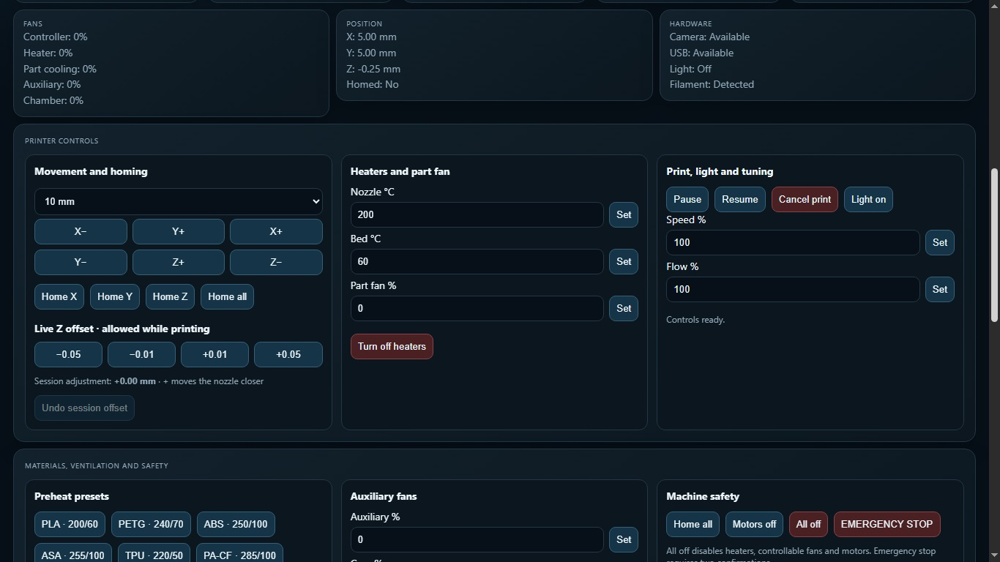
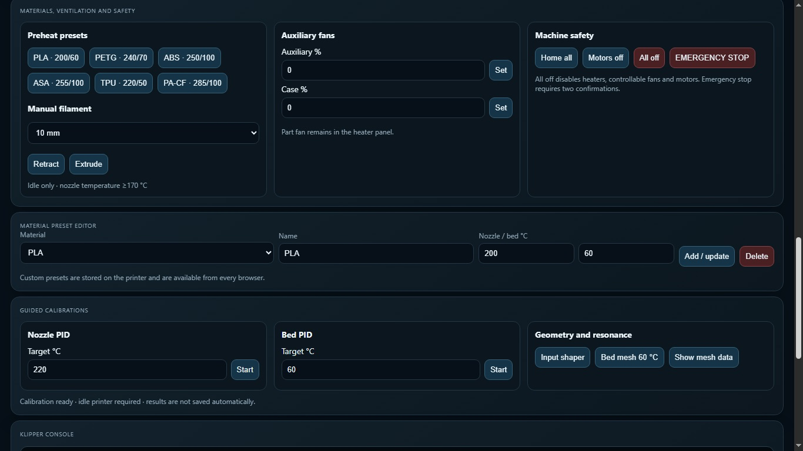
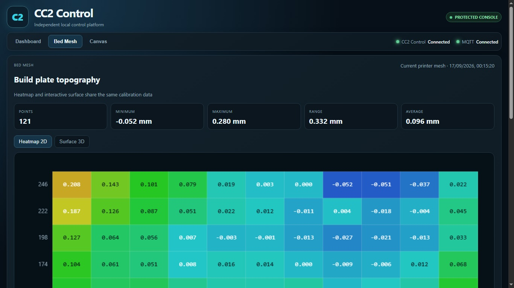
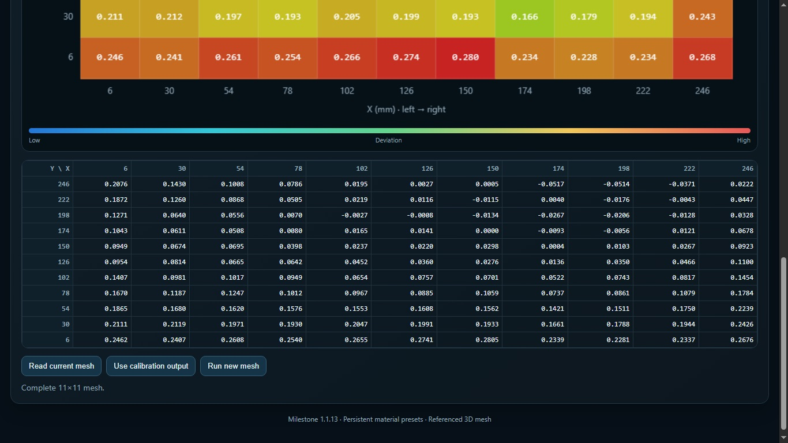
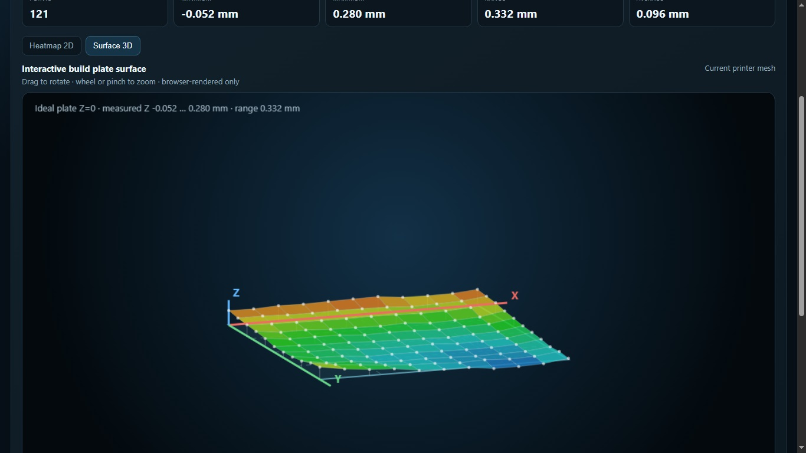
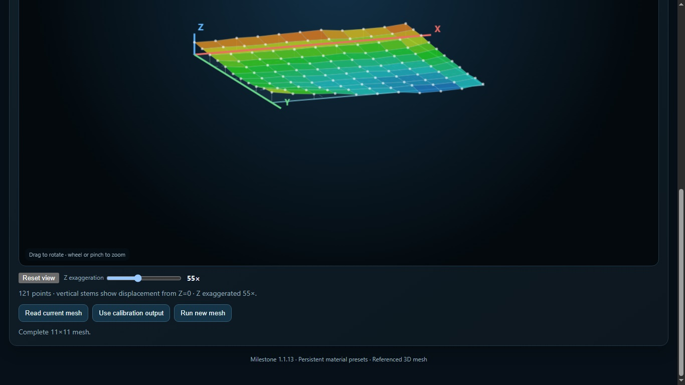
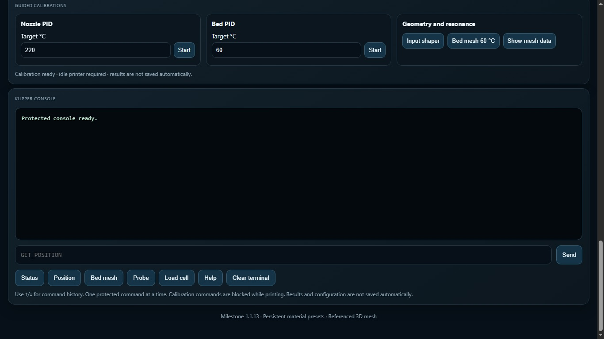

# CC2 Control 1.1.17

CC2 Control is a lightweight local control platform integrated into Centauri Carbon 2 Community Firmware v3.9. It runs directly on the printer and serves a dependency-free web interface on TCP port 8081.

Open:

```text
http://PRINTER-IP:8081
```

## Dashboard


The dashboard combines the live camera, printer and job status, temperatures, high-DPI browser-side thermal history, fan speeds, position, hardware state, available memory, uptime, system load and MQTT message count.

## Protected printer controls



Available controls include:

- protected jogging and homing;
- live session Z-offset adjustment;
- nozzle and bed temperature targets;
- part, auxiliary and enclosure fan control;
- pause, resume and cancel;
- light, print speed and flow controls;
- manual retract and extrude;
- motor, heater and emergency-stop actions.

Safety checks reject inappropriate commands while the printer is busy. The protected console permits selected diagnostic and calibration commands without exposing an unrestricted shell through the browser.

## Persistent material presets



PLA, PETG, ABS, ASA, TPU and PA-CF presets are supplied by default. Users can add, edit and delete arbitrary material names and temperatures. Custom presets are stored on the printer under `/opt/usr` and remain available from every browser and across A/B firmware updates.

## Bed Mesh 2D and 3D





The Bed Mesh view displays all 121 points of the printer's 11×11 mesh, including minimum, maximum, range and average values.





The browser-rendered 3D surface can be rotated and zoomed. Real X/Y/Z references, an ideal Z=0 plane and adjustable Z exaggeration make displacement relative to a flat build plate easy to understand. Rendering is performed in the browser and does not add meaningful load to the printer.

## ELEGOO Canvas


CC2 Control detects Canvas through the printer's native MQTT method 2005. It displays all four physical slots, active tray, colour, material, brand and temperature range. Protected controls support load, unload and material editing.

Canvas discovery starts automatically at boot, retries through the printer's hardware initialization sequence, stops after a valid response and restarts after an MQTT reconnection.

## G-code library and printing

The G-code tab lists printable files from internal memory and USB storage, including files inside USB folders. Before a print starts, CC2 Control inspects tool usage and opens a spool-mapping dialog for assigning each G-code tool to one of the four Canvas trays.

The printer does not reliably accept direct public MQTT starts using `storage_media:"u-disk"`. Version 1.1.17 therefore reproduces the touchscreen preparation workflow safely: it validates the USB path, atomically imports the selected file into internal storage and submits the proven local method 1020 request. The original USB file is not modified.

## Guided calibrations and console



Guided actions are provided for nozzle PID, bed PID, input shaper and bed-mesh calibration. Calibration commands require an idle printer and results are not saved automatically unless explicitly requested through the supported workflow.

## Version 1.1.17 calibration fix

Version 1.1.17 keeps the protected console responsive after long resonance and
bed-mesh calibrations. It retains up to 256 KiB of output, recognises completion
markers even when JSON data is split across reads, and safely releases a saturated
calibration stream after ten seconds without new reports. The calibration itself is
not cancelled.

## First-run setup

A clean installation opens a browser configurator at `http://PRINTER-IP:8081`. Existing credentials and presets stored under `/opt/usr` survive normal A/B firmware updates.

> **Mandatory first reboot:** after completing the first-run configuration, perform one complete printer reboot. Wait 30–60 seconds before reopening CC2 Control. This allows Canvas to synchronize correctly with both CC2 Control and the original touchscreen interface.

## Runtime and resource use

CC2 Control is a single statically linked ARM process managed by `procd`. Hardware validation measured approximately 560 KiB resident memory, one thread and negligible idle CPU use. The installed directory occupies roughly 1.6 MiB.

## Health checks

```sh
wget -qO- http://127.0.0.1:8081/api/health
wget -qO- http://127.0.0.1:8081/api/setup
wget -qO- http://127.0.0.1:8081/api/canvas
```

A healthy configured system reports version `1.1.17`, `mqtt_connected:true`, `mqtt_registered:true` and `snapshot_received:true`.
